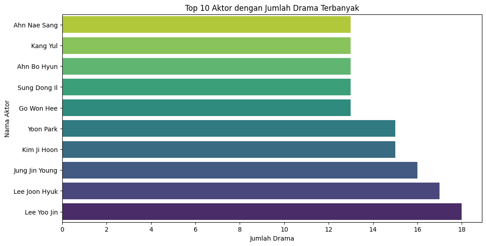
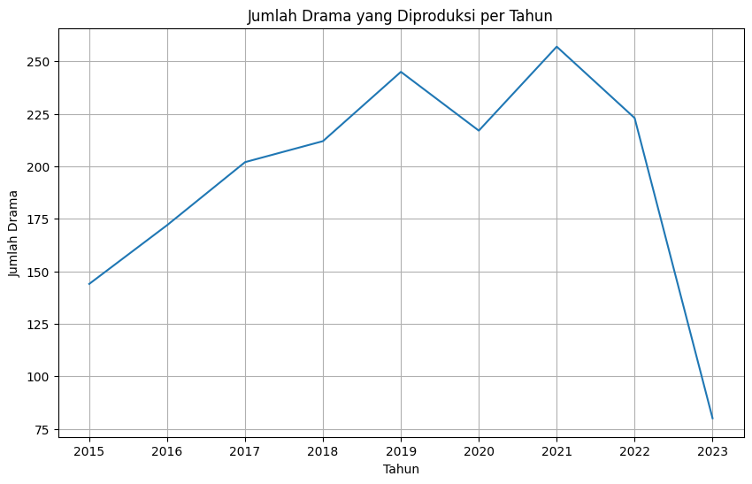
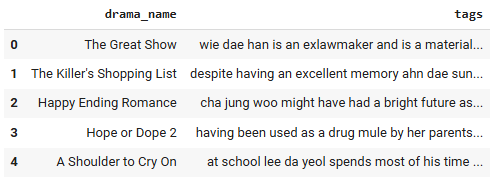
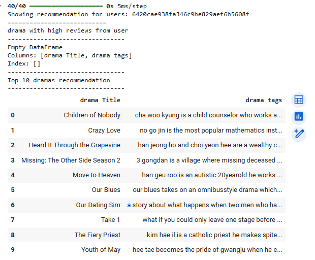
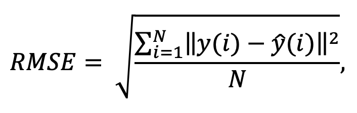
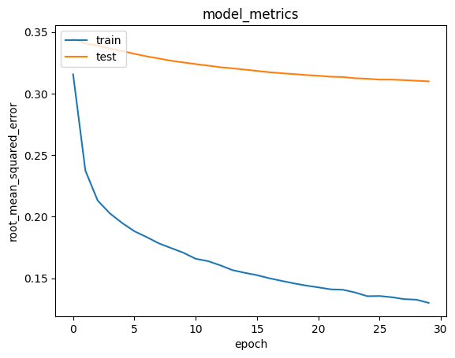
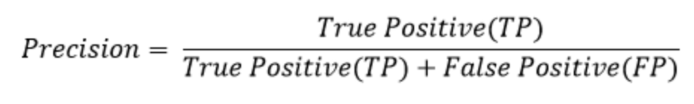
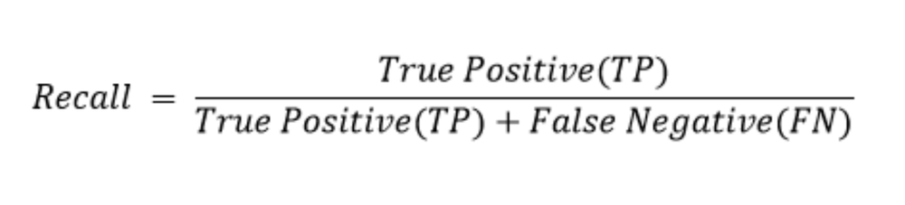
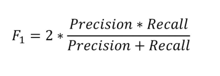

# Laporan Proyek Machine Learning - Rifdah Hansya Rofifah

## Project Overview
<!-- 
Pada bagian ini, Kamu perlu menuliskan latar belakang yang relevan dengan proyek yang diangkat.

**Rubrik/Kriteria Tambahan (Opsional)**:
- Jelaskan mengapa proyek ini penting untuk diselesaikan.
- Menyertakan hasil riset terkait atau referensi. Referensi yang diberikan harus berasal dari sumber yang kredibel dan author yang jelas.
  
  Format Referensi: [A movie recommendation algorithm based on genre correlations](https://www.sciencedirect.com/science/article/abs/pii/S0957417412001509)  -->

Dalam era digital saat ini, industri hiburan, khususnya drama Korea (K-Drama), mengalami perkembangan pesat dengan jumlah produksi yang terus meningkat. Seiring dengan bertambahnya jumlah K-Drama yang tersedia di berbagai platform streaming, pengguna sering kali mengalami kesulitan dalam memilih drama yang sesuai dengan preferensi mereka. Oleh karena itu, sistem rekomendasi K-Drama menjadi solusi yang dapat membantu pengguna menemukan tontonan yang paling relevan berdasarkan minat dan histori mereka.

Sistem rekomendasi K-Drama memiliki peran penting dalam meningkatkan pengalaman pengguna dengan memberikan rekomendasi yang sesuai dengan preferensi mereka tanpa harus mencari secara manual. Selain itu, sistem ini dapat mengoptimalkan waktu pengguna dengan mengurangi kebutuhan untuk membaca banyak ulasan atau mencari rekomendasi secara acak. Dengan personalisasi konten, layanan streaming dapat menawarkan pilihan yang lebih relevan bagi setiap pengguna, sehingga meningkatkan kepuasan dan loyalitas mereka. Lebih jauh lagi, rekomendasi yang lebih akurat akan mendorong pengguna untuk menghabiskan lebih banyak waktu di platform, yang pada akhirnya meningkatkan engagement dan retensi pelanggan.

Penelitian sebelumnya menunjukkan bahwa algoritma berbasis genre correlations, yang merupakan bentuk dari content-based filtering, memiliki keunggulan dalam mengatasi masalah cold-start dan sparsity dibandingkan dengan collaborative filtering tradisional. Oleh karena itu, pendekatan berbasis genre correlations dianggap lebih stabil dan dapat diandalkan dalam merekomendasikan film, terutama dalam skenario dengan keterbatasan data pengguna. 

Referensi: [A movie recommendation algorithm based on genre correlations](https://www.sciencedirect.com/science/article/abs/pii/S0957417412001509) 

## Business Understanding
<!-- 
Pada bagian ini, Anda perlu menjelaskan proses klarifikasi masalah.

Bagian laporan ini mencakup:

### Problem Statements

Menjelaskan pernyataan masalah:
- Pernyataan Masalah 1
- Pernyataan Masalah 2
- Pernyataan Masalah n

### Goals

Menjelaskan tujuan proyek yang menjawab pernyataan masalah:
- Jawaban pernyataan masalah 1
- Jawaban pernyataan masalah 2
- Jawaban pernyataan masalah n

Semua poin di atas harus diuraikan dengan jelas. Anda bebas menuliskan berapa pernyataan masalah dan juga goals yang diinginkan.

**Rubrik/Kriteria Tambahan (Opsional)**:
- Menambahkan bagian “Solution Approach” yang menguraikan cara untuk meraih goals. Bagian ini dibuat dengan ketentuan sebagai berikut: 

    ### Solution statements
    - Mengajukan 2 atau lebih solution approach (algoritma atau pendekatan sistem rekomendasi). -->

Proyek ini bertujuan untuk membangun sistem rekomendasi K-Drama menggunakan pendekatan Content-Based Filtering dan Collaborative Filtering. Sistem ini akan membantu pengguna menemukan drama yang sesuai dengan preferensi mereka berdasarkan informasi dari drama itu sendiri dan ulasan dari pengguna lain.

### Problem Statements
- Bagaimana cara memberikan rekomendasi K-Drama yang relevan kepada pengguna berdasarkan informasi dari drama itu sendiri, seperti pemain, sutradara, dan sinopsis?

- Bagaimana cara memberikan rekomendasi dengan mempertimbangkan skor yang diberikan oleh pengguna?

### Goals
- Mengembangkan sistem rekomendasi berbasis Content-Based Filtering yang mampu menyarankan K-Drama berdasarkan kesamaan fitur deskriptif seperti nama pemain, sutradara, dan sinopsis.
- Mengembangkan sistem rekomendasi berbasis Collaborative Filtering yang memanfaatkan skor dari pengguna untuk menemukan K-Drama yang disukai.

    ### Solution statements
    1. Content-Based Filtering
    - Pendekatan ini menggunakan informasi dari K-Drama seperti nama pemain, sutradara, dan sinopsis untuk mencari kesamaan antar-drama. Teknik seperti TF-IDF (Term Frequency-Inverse Document Frequency) dapat digunakan untuk mengolah sinopsis menjadi vektor fitur.
    - Algoritma seperti Cosine Similarity akan digunakan untuk mengukur kemiripan antara drama berdasarkan fitur-fitur yang tersedia.

    2. Collaborative Filtering
    - Model ini menggunakan pendekatan Neural Collaborative Filtering (NCF) dengan:
      - Matrix Factorization (MF) menggunakan embedding layers.
      - Dot product sebagai interaksi antara user dan item.
      - Bias layers untuk meningkatkan fleksibilitas prediksi.
      - Sigmoid activation untuk prediksi biner.
      - Binary crossentropy loss untuk optimasi. 


## Data Understanding
<!-- Paragraf awal bagian ini menjelaskan informasi mengenai jumlah data, kondisi data, dan informasi mengenai data yang digunakan. Sertakan juga sumber atau tautan untuk mengunduh dataset. Contoh: [UCI Machine Learning Repository](https://www.kaggle.com/datasets/chanoncharuchinda/korean-drama-2015-23-actor-and-reviewmydramalist).

Selanjutnya, uraikanlah seluruh variabel atau fitur pada data. Sebagai contoh:  

Variabel-variabel pada Restaurant UCI dataset adalah sebagai berikut:
- accepts : merupakan jenis pembayaran yang diterima pada restoran tertentu.
- cuisine : merupakan jenis masakan yang disajikan pada restoran.
- dst 

**Rubrik/Kriteria Tambahan (Opsional)**:
- Melakukan beberapa tahapan yang diperlukan untuk memahami data, contohnya teknik visualisasi data beserta insight atau exploratory data analysis.
-->

Dataset ini terdiri dari tiga tabel utama yang berkaitan dengan drama Korea, yaitu **kdrama**, **actors**, dan **reviews**. Dataset ini mencakup informasi tentang judul drama, aktor yang berperan, serta ulasan dari pengguna. Dataset ini dapat diunduh dari [Korean Drama from 2015-2023 with Actors & Reviews](https://www.kaggle.com/datasets/chanoncharuchinda/korean-drama-2015-23-actor-and-reviewmydramalist).

Dataset ini memiliki total **1752** entri pada tabel **kdrama**, **8659** entri pada tabel **actors**, dan **10625** entri pada tabel **reviews**. Namun, beberapa kolom dalam dataset memiliki nilai yang hilang, seperti kolom **director** dan **screenwriter** pada tabel kdrama.

Berikut adalah variabel-variabel dalam masing-masing tabel:

### 1. Tabel Kdrama
- **kdrama_id**: ID unik untuk setiap drama.
- **drama_name**: Nama dari drama Korea.
- **year**: Tahun rilis dari drama.
- **director**: Nama sutradara drama (beberapa nilai kosong).
- **screenwriter**: Nama penulis skenario (beberapa nilai kosong).
- **country**: Negara asal drama (semua bernilai "Korea").
- **type**: Jenis drama, seperti TV atau Web drama.
- **tot_eps**: Jumlah total episode.
- **duration**: Durasi rata-rata per episode dalam menit.
- **start_dt**: Tanggal mulai tayang.
- **end_dt**: Tanggal selesai tayang.
- **aired_on**: Hari dalam seminggu drama ditayangkan (beberapa nilai kosong).
- **org_net**: Stasiun TV atau platform streaming asli (beberapa nilai kosong).
- **content_rt**: Klasifikasi usia konten drama.
- **synopsis**: Deskripsi singkat mengenai alur cerita (beberapa nilai kosong).
- **rank**: Peringkat drama berdasarkan skor keseluruhan.
- **pop**: Popularitas drama berdasarkan jumlah penonton.

### 2. Tabel Actors
- **actor_id**: ID unik untuk setiap aktor.
- **actor_name**: Nama aktor.
- **drama_name**: Nama drama tempat aktor berperan.
- **character_name**: Nama karakter yang diperankan oleh aktor.
- **role**: Peran dalam drama, seperti pemeran utama atau pemeran pendukung.

### 3. Tabel Reviews
- **user_id**: ID unik pengguna yang memberikan ulasan.
- **title**: Judul ulasan.
- **story_score**: Skor yang diberikan pengguna untuk cerita drama.
- **acting_cast_score**: Skor untuk kualitas akting dan pemilihan pemain.
- **music_score**: Skor untuk musik latar drama.
- **rewatch_value_score**: Skor terkait nilai untuk ditonton ulang.
- **overall_score**: Skor keseluruhan yang diberikan oleh pengguna.
- **review_text**: Isi ulasan pengguna (beberapa nilai kosong).
- **ep_watched**: Jumlah episode yang sudah ditonton oleh pengguna.
- **n_helpful**: Jumlah orang yang menganggap ulasan ini membantu.

Dataset ini dapat digunakan untuk berbagai analisis, seperti rekomendasi drama berdasarkan skor ulasan, analisis popularitas aktor, atau klasifikasi drama berdasarkan genre dan rating kontennya.

**Exploratory Data Analysis (EDA)**:
- Aktor Lee Yoo Jin merupakan aktor paling banyak memerankan drama, yaitu sebanyak 18 drama.
  

  


- Berdasarkan hasil visualisasi, tahun 2021 mencatat jumlah produksi drama terbanyak.
  

  

## Data Preparation
<!-- Pada bagian ini Anda menerapkan dan menyebutkan teknik data preparation yang dilakukan. Teknik yang digunakan pada notebook dan laporan harus berurutan.

**Rubrik/Kriteria Tambahan (Opsional)**: 
- Menjelaskan proses data preparation yang dilakukan
- Menjelaskan alasan mengapa diperlukan tahapan data preparation tersebut. -->

Dalam tahap ini, dilakukan dua kali proses data preparation sesuai dengan metode rekomendasi yang akan digunakan, yaitu Content-Based Filtering (CBF) dan Collaborative Filtering (CF). Setiap tahapan dilakukan untuk memastikan bahwa data siap digunakan dalam proses rekomendasi.

### Data Preparation untuk Content-Based Filtering
Untuk metode Content-Based Filtering, variabel yang digunakan adalah `kdrama` dan `actors`. Beberapa langkah yang dilakukan meliputi:

1. **Menggabungkan Data**
   Data dari `kdrama` dan `actors` digabungkan berdasarkan kolom `drama_name` dengan metode *left join* untuk memastikan semua drama tetap masuk dalam dataset.
   ```python
   kdrama_info_df = pd.merge(kdrama, actors, on='drama_name', how='left')
   ```
    Penggabungan ini bertujuan untuk menghubungkan informasi drama dengan aktor yang terlibat, yang nantinya digunakan untuk pembuatan sistem rekomendasi.

2. **Menghapus Kolom yang Tidak Diperlukan**
   Beberapa kolom yang tidak relevan dihapus untuk mengurangi dimensi data dan mempercepat proses pemodelan.
   ```python
   columns_to_drop = ['role', 'character_name', 'pop', 'content_rt', 'screenwriter', 'country', 'type', 'start_dt', 'end_dt', 'aired_on', 'org_net', 'rank']
   kdrama_info_df = kdrama_info_df.drop(columns=columns_to_drop, errors='ignore')
   ```
    Kolom-kolom ini tidak berkontribusi langsung dalam sistem rekomendasi berbasis konten.

3. **Menangani Missing Value**
   - Kolom `director` diisi dengan string kosong (`""`).
   - Kolom `duration` diisi dengan nilai rata-rata (mean).
   - Kolom `synopsis` diisi dengan string kosong (`""`).
   ```python
   kdrama_info_df['director'].fillna("", inplace=True)
   kdrama_info_df['duration'].fillna(kdrama_info_df['duration'].mean(), inplace=True)
   kdrama_info_df['synopsis'].fillna("", inplace=True)
   ```
    Pengisian nilai kosong pada `director` dan `synopsis` mencegah error dalam proses tokenisasi, sementara pengisian mean pada `duration` mempertahankan nilai yang lebih representatif.

4. **Membagi dan Mengelompokkan Data**
   - `synopsis` diubah menjadi daftar kata.
   ```python
   kdrama_info_df['synopsis'] = kdrama_info_df['synopsis'].apply(lambda x: x.split())
   ```
   - Kelompokkan `synopsis`, `actor_name`, dan `director` ke dalam satu kolom `tags`.
   ```python
   kdrama_info_df['tags'] = kdrama_info_df['synopsis'] + kdrama_info_df['actor_name'].apply(lambda x: [x]) + kdrama_info_df['director'].apply(lambda x: [x])
   ```
   - Gabungkan semua elemen dalam `tags` menjadi string tunggal.
   ```python
   kdrama_info_df['tags'] = kdrama_info_df['tags'].apply(lambda x: " ".join(x))
   ```
   - Buat dataframe akhir untuk CBF.
   ```python
   kdrama_df = kdrama_info_df[['kdrama_id', 'drama_name', 'tags']]
   ```
    Dengan penggabungan ini, fitur-fitur penting untuk pencocokan berbasis konten tersimpan dalam satu kolom.

5. **Penerapan TF-IDF Vectorizer**
    Pada tahap ini, digunakan teknik TF-IDF (Term Frequency - Inverse Document Frequency) untuk mengubah data dalam kolom `tags` menjadi representasi numerik:

    ```python
    from sklearn.feature_extraction.text import TfidfVectorizer

    tf = TfidfVectorizer()
    tf.fit(kdrama_df['tags'])
    tfidf_matrix = tf.fit_transform(kdrama_df['tags'])
    tfidf_matrix.todense()
    ```

### Data Preparation untuk Collaborative Filtering
Pada metode Collaborative Filtering, hanya variabel `reviews` dan `kdrama` (dengan `kdrama_id`) yang digunakan. Berikut langkah-langkahnya:

1. **Menggabungkan Data**
   Dataset `reviews` digabungkan dengan `kdrama` berdasarkan kolom `drama_name` untuk mendapatkan `kdrama_id`.
   ```python
   reviews_grouped = pd.merge(reviews, kdrama[['kdrama_id', 'drama_name']], left_on='title', right_on='drama_name', how='left')
   ```
    Diperlukan untuk menghubungkan informasi review dengan drama yang memiliki ID unik.

2. **Encoding `user_id`**
   - Membuat daftar unik dari `user_id`.
   ```python
   user_ids = reviews_grouped['user_id'].unique().tolist()
   ```
   - Melakukan encoding pada `user_id`.
   ```python
   user_to_user_encoded = {x: i for i, x in enumerate(user_ids)}
   ```
   - Membuat pemetaan sebaliknya dari angka ke `user_id`.
   ```python
   user_encoded_to_user = {i: x for i, x in enumerate(user_ids)}
   ```
   - Mapping `user_id` ke dataframe.
   ```python
   reviews_grouped['user_encode'] = reviews_grouped['user_id'].map(user_to_user_encoded)
   ```
    Collaborative Filtering bekerja dengan matriks numerik, sehingga `user_id` perlu dikonversi ke angka.

3. **Encoding `kdrama_id`**
   - Membuat daftar unik dari `kdrama_id`.
   ```python
   dramas = reviews_grouped['kdrama_id'].unique().tolist()
   ```
   - Melakukan encoding pada `kdrama_id`.
   ```python
   drama_to_drama_encoded = {x: i for i, x in enumerate(dramas)}
   ```
   - Membuat pemetaan sebaliknya dari angka ke `kdrama_id`.
   ```python
   drama_encoded_to_drama = {i: x for i, x in enumerate(dramas)}
   ```
   - Mapping `kdrama_id` ke dataframe.
   ```python
   reviews_grouped['kdrama_encode'] = reviews_grouped['kdrama_id'].map(drama_to_drama_encoded)
   ```
    Sama seperti `user_id`, `kdrama_id` perlu dikonversi ke angka agar bisa digunakan dalam model.

4. **Membuat Dataframe Final untuk CF**
   Dataset akhir berisi kolom-kolom yang diperlukan untuk Collaborative Filtering.
   ```python
   reviews_df = reviews_grouped[['user_id', 'kdrama_id', 'drama_name', 'overall_score', 'user_encode', 'kdrama_encode']]
   ```
    Hanya kolom esensial yang disimpan agar model bisa fokus pada hubungan antara pengguna dan drama.

5. **Pembagian Data**
    Dataset dibagi menjadi tiga bagian: 80% untuk data latih, 10% untuk validasi, dan 10% untuk pengujian:

    ```python
    x = reviews_df[['user_encode', 'kdrama_encode']].values
    y = reviews_df['overall_score'].apply(lambda x: (x - min_overall_score) / (max_overall_score - min_overall_score)).values

    train_indices = int(0.8 * reviews_df.shape[0])
    val_indices = int(0.9 * reviews_df.shape[0])
    x_train, x_val, x_test, y_train, y_val, y_test = (
        x[:train_indices], x[train_indices:val_indices], x[val_indices:],
        y[:train_indices], y[train_indices:val_indices], y[val_indices:]
    )
    ```


Dengan tahapan ini, data telah siap digunakan untuk membangun model rekomendasi menggunakan Content-Based Filtering dan Collaborative Filtering.


## Modeling
<!-- Tahapan ini membahas mengenai model sisten rekomendasi yang Anda buat untuk menyelesaikan permasalahan. Sajikan top-N recommendation sebagai output.

**Rubrik/Kriteria Tambahan (Opsional)**: 
- Menyajikan dua solusi rekomendasi dengan algoritma yang berbeda.
- Menjelaskan kelebihan dan kekurangan dari solusi/pendekatan yang dipilih. -->

Pada tahap ini, sistem rekomendasi dikembangkan menggunakan dua pendekatan yang berbeda, yaitu Content-Based Filtering (CBF) dan Collaborative Filtering (CF). Kedua pendekatan ini bertujuan untuk memberikan rekomendasi drama Korea berdasarkan data yang telah disiapkan sebelumnya.

### 1. Content-Based Filtering (CBF)
Pendekatan Content-Based Filtering digunakan dengan memanfaatkan informasi dari konten drama, dalam hal ini tag yang menggambarkan karakteristik dari setiap drama.

#### a. Perhitungan Cosine Similarity
Setelah memperoleh representasi vektor dari tag drama, dihitung kemiripan antar-drama menggunakan Cosine Similarity:

```python
from sklearn.metrics.pairwise import cosine_similarity

cosine_sim = cosine_similarity(tfidf_matrix)
```

#### b. Implementasi Fungsi Rekomendasi
Fungsi berikut digunakan untuk memberikan rekomendasi drama berdasarkan kemiripan tag:

```python
def drama_recommendations(nama_drama, similarity_data=cosine_sim_df, items=kdrama_df[['drama_name', 'tags']], k=5):
    """
    Memberikan rekomendasi drama berdasarkan kemiripan tag.
    """
    index = similarity_data.loc[:,nama_drama].to_numpy().argpartition(range(-1, -k, -1))
    closest = similarity_data.columns[index[-1:-(k+2):-1]]
    closest = closest.drop(nama_drama, errors='ignore')
    return pd.DataFrame(closest).merge(items).head(k)
```

Sebagai contoh, berikut hasil rekomendasi untuk drama "18 Again":

```python
# Mendapatkan rekomendasi drama yang mirip dengan 18 Again
drama_recommendations('18 Again')
```

Hasil rekomendasi menggunakan Content-Based Filtering ditampilkan pada gambar berikut:



### 2. Collaborative Filtering (CF)
Pendekatan Collaborative Filtering digunakan untuk memberikan rekomendasi berdasarkan interaksi pengguna dengan drama. Model ini menggunakan data rating pengguna dari `reviews_df` yang telah diproses sebelumnya.

#### a. Pembangunan Model
Model dibuat menggunakan RecommenderNet dengan embedding sebanyak 50 dimensi:

```python
model = RecommenderNet(num_users, num_drama, 50)  # Inisialisasi model
```

#### b. Pelatihan Model
Model dilatih menggunakan data latih dengan batch size 8 dan 30 epoch:

```python
history = model.fit(
    x=x_train,
    y=y_train,
    batch_size=8,
    epochs=30,
    validation_data=(x_val, y_val)
)
```

#### c. Hasil Rekomendasi
Hasil rekomendasi drama berdasarkan Collaborative Filtering ditampilkan pada gambar berikut:


### 3. Perbandingan Pendekatan
| Pendekatan               | Kelebihan | Kekurangan |
|-------------------------|----------|-----------|
| **Content-Based Filtering (CBF)** | Tidak bergantung pada data pengguna, dapat merekomendasikan item baru dengan tag yang mirip | Tidak dapat merekomendasikan item yang tidak memiliki deskripsi yang cukup |
| **Collaborative Filtering (CF)** | Mempertimbangkan interaksi pengguna, dapat memberikan rekomendasi personal | Membutuhkan data interaksi dalam jumlah besar, sulit memberikan rekomendasi untuk pengguna baru |

Berdasarkan hasil yang diperoleh, kedua pendekatan memiliki keunggulan dan kelemahannya masing-masing. Content-Based Filtering lebih cocok untuk merekomendasikan drama berdasarkan karakteristik yang mirip, sedangkan Collaborative Filtering memberikan rekomendasi yang lebih personal berdasarkan preferensi pengguna.


## Evaluation
<!-- Pada bagian ini Anda perlu menyebutkan metrik evaluasi yang digunakan. Kemudian, jelaskan hasil proyek berdasarkan metrik evaluasi tersebut.

Ingatlah, metrik evaluasi yang digunakan harus sesuai dengan konteks data, problem statement, dan solusi yang diinginkan.

**Rubrik/Kriteria Tambahan (Opsional)**: 
- Menjelaskan formula metrik dan bagaimana metrik tersebut bekerja. -->

### 1. Evaluasi Collaborative Filtering
Model Collaborative Filtering dievaluasi menggunakan metrik **Root Mean Squared Error (RMSE)** untuk mengukur seberapa akurat model dalam memprediksi skor drama berdasarkan data pengguna. RMSE dihitung dengan rumus berikut:  



di mana y(i) adalah nilai sebenarnya, ŷ(i) adalah nilai prediksi, dan N adalah jumlah sampel. Semakin rendah nilai RMSE, semakin baik model dalam memprediksi data dengan kesalahan yang lebih kecil.  

#### **Hasil Evaluasi**  
Berdasarkan hasil evaluasi, model menunjukkan performa yang stabil dengan tren **penurunan RMSE**, yang berarti model semakin baik dalam melakukan prediksi. Berikut adalah hasil evaluasi pada data latih, validasi, dan uji:  

- **Training Loss:** 0.6481  
- **Training RMSE:** 0.3187  
- **Validation Loss:** 0.6347 
- **Validation RMSE:** 0.3096  
- **Test Loss:** 0.6609  
- **Test RMSE:** 0.3281

#### Visualisasi Metriks



Berdasarkan hasil visualisasi, dapat disimpulkan bahwa model menunjukkan penurunan RMSE yang stabil, menandakan peningkatan kemampuan model dalam memprediksi skor drama berdasarkan data yang diberikan. Selain itu, tidak terdapat indikasi overfitting yang ekstrem, karena RMSE pada data uji juga mengalami penurunan, meskipun tetap lebih tinggi dibandingkan dengan RMSE pada data latih.


### 2. Evaluasi Content-Based Filtering

Pada evaluasi Collaborative Filtering (CBF), metrik yang digunakan adalah **precision**, **recall**, dan **F1-score**. Ketiga metrik ini digunakan untuk mengukur performa model dalam memberikan rekomendasi yang akurat berdasarkan nilai cosine similarity antar item (dalam hal ini, drama Korea). 

- **Precision** mengukur seberapa banyak rekomendasi yang relevan dari seluruh rekomendasi yang diberikan. Formula precision adalah:  
  
- **Recall** mengukur seberapa banyak rekomendasi relevan yang berhasil ditemukan dari seluruh data yang relevan. Formula recall adalah:  
  
- **F1-score** adalah rata-rata harmonis dari precision dan recall, yang memberikan gambaran yang lebih menyeluruh tentang keseimbangan antara keduanya. Formula F1-score adalah:  
  

Pada evaluasi ini, threshold yang digunakan untuk menentukan relevansi adalah 0.6, yang berarti pasangan kdrama dianggap relevan jika nilai cosine similarity mereka lebih besar atau sama dengan 0.6.

**Hasil Evaluasi**  
Berdasarkan hasil evaluasi menggunakan metrik-metrik tersebut, model menunjukkan performa yang sangat baik. Semua nilai **precision**, **recall**, dan **F1-score** mencapai **1.0**, yang berarti model berhasil memberikan rekomendasi yang akurat tanpa kesalahan dalam klasifikasi (tidak ada false positive atau false negative). Hasil ini mengindikasikan bahwa model berhasil memprediksi relevansi kdrama secara sempurna.


<!-- 
**---Ini adalah bagian akhir laporan---**

_Catatan:_
- _Anda dapat menambahkan gambar, kode, atau tabel ke dalam laporan jika diperlukan. Temukan caranya pada contoh dokumen markdown di situs editor [Dillinger](https://dillinger.io/), [Github Guides: Mastering markdown](https://guides.github.com/features/mastering-markdown/), atau sumber lain di internet. Semangat!_
- Jika terdapat penjelasan yang harus menyertakan code snippet, tuliskan dengan sewajarnya. Tidak perlu menuliskan keseluruhan kode project, cukup bagian yang ingin dijelaskan saja. -->
